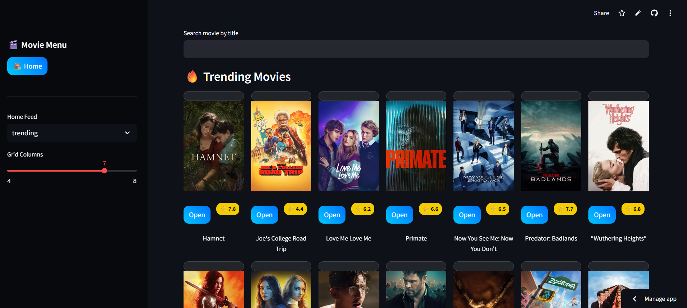
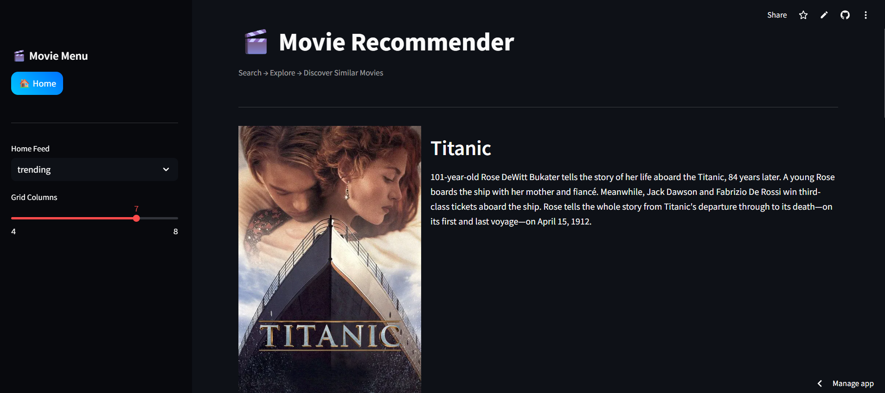
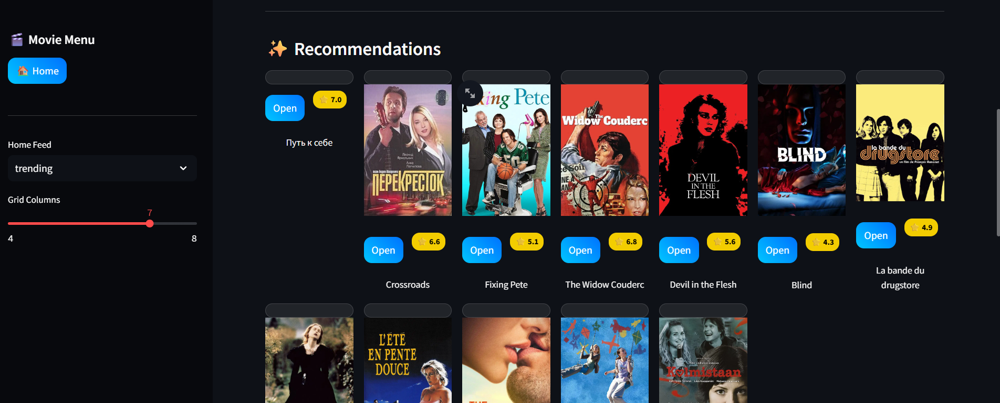

🎬 Movie Recommendation System 

link : https://movie-recommendation-75gafsl38nfkpzlfx2tntu.streamlit.app/

A full-stack Movie Recommendation Web Application that provides personalized movie suggestions using content-based filtering.

The project is built with a modern deployment architecture:

⚡ Backend API built using FastAPI

🎨 Frontend built using Streamlit

☁️ Backend deployed on Render

🌐 Frontend deployed on Streamlit Cloud

🚀 Backend hosted on Render

🔥 Features

🔎 Search movies by title

🎞 View detailed movie information

⭐ Display movie ratings & posters

🤝 Content-based recommendations (TF-IDF)

🎨 Cinematic dark glass UI

📱 Responsive grid layout

⚡ Fast API-based architecture

🏗️ Architecture
User → Streamlit Frontend → FastAPI Backend → TMDB API

🧠 Recommendation System

The recommendation engine uses:

TF-IDF vectorization

Cosine similarity

Genre-based filtering

This enables:

Content similarity recommendations

Related movie suggestions

Hybrid approach (TF-IDF + Genre)

## 📸 UI Preview

### 🏠 Home Page

### 🎬 Movie Details

### ⭐ Recommendations
